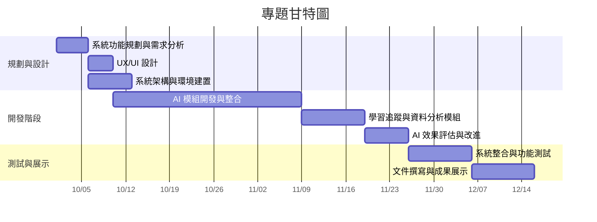

##### 專題題目：智慧校園學習助理系統-商科基本領域
# 
##### 工作分配
##### 任務1 系統功能規劃與需求分析 5天
##### 任務2 使用者體驗(UX/UI)設計 4天
##### 任務3 系統架構與環境建置 7天
##### 任務4 AI模組開發與整合 30天
##### 任務5 學習追蹤與資料分析模組 10天
##### 任務6 AI效果評估與改進 7天
##### 任務7 系統整合與功能測試 10天
##### 任務8 文件撰寫與成果展示 10天
# 
##### 組長：C112118230張簡卉姍：任務4、任務6
##### 組員：C112118215葉孟勳：任務2、任務8
##### 組員：C112118222張芮晨：任務1、任務5
##### 組員：C112118228陳姸蓁：任務3、任務7

#PERT/CPM 圖
---

## 任務清單與分工

| 任務 | 名稱                         | 需時(天) | 負責人 | 前置任務 |
|------|------------------------------|----------|--------|----------|
| 1    | 系統功能規劃與需求分析       | 5        | 張芮晨 | -        |
| 2    | 使用者體驗 (UX/UI) 設計      | 4        | 葉孟勳 | 1        |
| 3    | 系統架構與環境建置           | 7        | 陳姸蓁 | 1        |
| 4    | AI 模組開發與整合            | 30       | 張簡卉姍 | 2,3      |
| 5    | 學習追蹤與資料分析模組       | 10       | 張芮晨 | 4        |
| 6    | AI 效果評估與改進            | 7        | 張簡卉姍 | 4,5      |
| 7    | 系統整合與功能測試           | 10       | 陳姸蓁 | 6        |
| 8    | 文件撰寫與成果展示           | 10       | 葉孟勳 | 7        |


# 專題甘特圖


```mermaid
flowchart LR
    A1[1 系統功能規劃與需求分析] --> A2[2 UX/UI 設計]
    A1 --> A3[3 系統架構與環境建置]
    A2 --> A4[4 AI 模組開發與整合]
    A3 --> A4
    A4 --> A5[5 資料分析模組]
    A4 --> A6[6 AI 效果評估與改進]
    A5 --> A6
    A6 --> A7[7 系統整合與測試]
    A7 --> A8[8 文件撰寫與展示]


