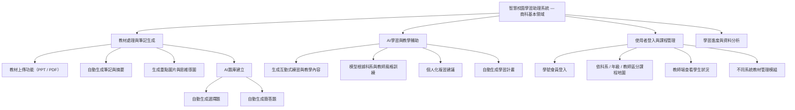

# 第十一組 智慧校園學習助理系統—商科基本領域

### 功能性需求
#### 1. 智慧筆記生成系統
##### 學生上傳教材（PPT、PDF、講義等）後，系統能自動生成筆記、摘要、重點圖片或思維導圖，並可根據不同老師的教學風格調整內容呈現方式

#### 2. 會員登入與課程分類系統
##### 學生使用「學號會員登入」進入系統，系統依據所屬科系與授課老師自動載入對應的課程地圖與教材範圍，避免跨系混用資料

#### 3. AI教學與學習追蹤功能
##### 系統可根據學生提問與作答紀錄，逐步優化模型，使AI更貼近該校、該科系的實際教學內容，並產生個人化複習建議與學習進度分析

### 非功能性需求
#### 1. 可擴充性
##### 系統架構需支援不同年級、科系、教師的資料模組化擴充，未來可延伸至其他年級或學科使用

#### 2. 可靠性與穩定性
##### 確保在同時多名學生上傳或生成筆記時，系統仍可穩定運行，不會中斷或資料錯亂

#### 3. 資料安全與隱私
##### 學生登入與上傳資料須加密儲存，並遵守學校資料保護規範，確保不同班級、科系的資料不被誤用或外洩

### 功能分解圖

### 使用案例說明
#### 使用案例一
| 項目 | 說明 |
|------|------|
| **使用案例名稱** | 教材上傳與自動生成筆記 |
| **主要參與者** | 學生 |
| **使用者** | 學生 |
| **目標** | 學生上傳課程教材（PPT 或 PDF），系統自動生成摘要與筆記內容 |
| **前置條件** | 使用者已登入系統並選擇所屬科系與課程 |
| **後置條件** | 筆記自動儲存於該課程資料夾中，可供學生瀏覽與下載 |
| **主要流程** | 1. 學生登入系統。 2. 選擇科系與課程。 3. 點擊「上傳教材」。 4. 系統分析教材內容並生成筆記與摘要。 5. 顯示生成結果並提供下載或再次修改選項。 |

#### 使用案例二
| 項目 | 說明 |
|------|------|
| **使用案例名稱** | AI 題庫與互動練習 |
| **主要參與者** | 學生、AI 模型 |
| **使用者** | 學生 |
| **目標** | 系統根據上傳教材自動生成題庫，讓學生進行互動練習與測驗 |
| **前置條件** | 系統中已有教材內容與生成筆記 |
| **後置條件** | 學生練習結果被記錄，AI 模型更新學習弱點資料 |
| **主要流程** | 1. 學生開啟課程頁面。 2. 選擇「開始練習」。 3. 系統根據教材自動出題。 4. 學生作答後立即獲得反饋。 5. 系統將作答結果與錯題統計保存至學習資料庫。 |

#### 使用案例三
| 項目 | 說明 |
|------|------|
| **使用案例名稱** | 教師查詢學生學習狀況 |
| **主要參與者** | 教師 |
| **使用者** | 教師 |
| **目標** | 教師可查閱學生的學習進度、練習紀錄與弱點分析，調整教學策略 |
| **前置條件** | 教師帳號已驗證並綁定對應課程 |
| **後置條件** | 教師可下載或匯出學習報表 |
| **主要流程** | 1. 教師登入系統。 2. 選擇授課科目與班級。 3. 系統顯示學生學習統計資料。 4. 教師可篩選個別學生或全班資料。 5. 可下載 CSV 或 PDF 報表作為教學依據。 |

### 使用案例圖

